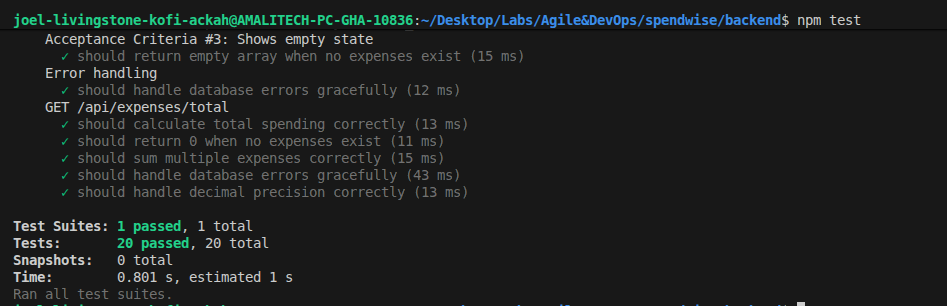
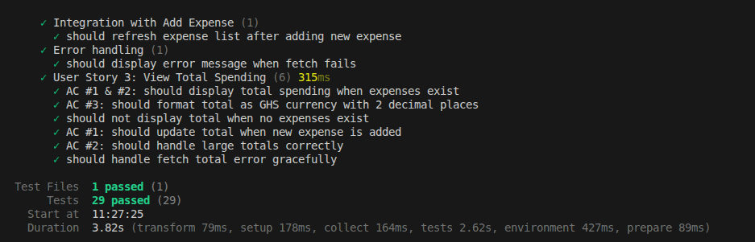
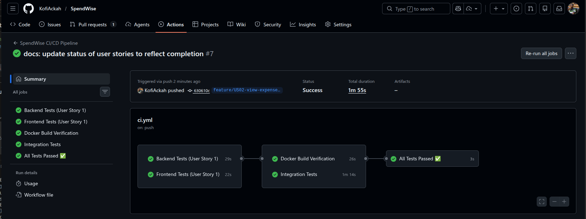
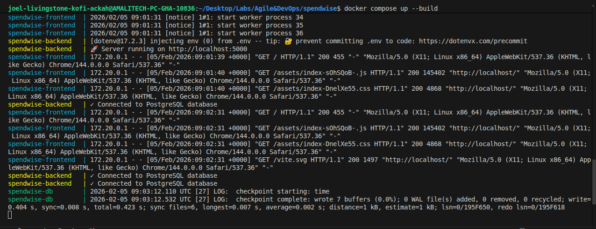

# SPRINT 1

**Sprint Goal:** Deliver core expense tracking functionality with CI/CD automation

---

## Sprint Planning

### Team Capacity
- **Available Story Points:** 6 points
- **Rationale:** First sprint establishing baseline velocity and DevOps pipeline

### Selected User Stories

#### US-001: Log Expense
**Story Points:** 3  
**Priority:** High

**User Story:**  
As a user, I want to enter the name and cost of an item I bought so that I can keep a record of my spending.

**Acceptance Criteria:**
- Input fields for Item Name and Amount present on UI
- Validation prevents empty names and negative amounts
- Data persists in PostgreSQL database
- UI reflects new item instantly with success feedback

**Tasks:**
- Create POST `/api/expenses` API endpoint
- Implement input validation in backend
- Build expense form component in React
- Add client-side validation
- Create unit tests (backend + frontend)
- Document API endpoint

---

#### US-002: View Expense List
**Story Points:** 2  
**Priority:** High

**User Story:**  
As a user, I want to see a list of all items I have added so that I can review my spending history.

**Acceptance Criteria:**
- Fetches data from Node.js API on component mount
- Displays list in chronological order (newest first)
- Shows "No expenses yet" message if list is empty
- List auto-refreshes after adding new expense

**Tasks:**
- Create GET `/api/expenses` API endpoint
- Implement ordering by created_at DESC
- Build expense list component
- Handle empty state
- Create unit tests (backend + frontend)
- Document API endpoint

---

#### US-003: View Total Spending
**Story Points:** 1  
**Priority:** High

**User Story:**  
As a user, I want to see the total sum of all my expenses so that I know my total spending.

**Acceptance Criteria:**
- Total updates automatically when items are added
- Backend calculates sum accurately using PostgreSQL SUM
- Formatted as GHS currency with 2 decimal places
- Total only visible when expenses exist

**Tasks:**
- Create GET `/api/expenses/total` API endpoint
- Implement PostgreSQL SUM aggregation
- Build total display component with gradient badge
- Format as GHS currency
- Create unit tests (backend + frontend)
- Document API endpoint

---

### Sprint Commitment
**Total Committed Story Points:** 6

**Selection Justification:**
- Stories represent core expense tracking workflow
- Establishes foundation for all subsequent features
- Validates end-to-end architecture (React → Node.js → PostgreSQL)
- US-001 and US-002 provide basic CRUD operations
- US-003 adds business logic (sum calculation)

---

## Sprint Execution Log

### Early Sprint

**Completed Work:**
- Development environment initialized with Docker Compose
- PostgreSQL database configured with expenses table
- Node.js backend with Express server setup
- React frontend with Vite configured
- CI/CD pipeline created with GitHub Actions

**US-001 Progress:**
- API endpoint for creating expenses implemented
- Input validation added (empty names, negative amounts)
- React form component created
- Client-side validation implemented
- 10 backend tests + 14 frontend tests written
- **Status: Complete **

**Burndown Update:** 3 story points remaining

---

### Mid-Sprint

**Completed Work:**
- US-001 reviewed and verified against Definition of Done

**US-002 Progress:**
- GET `/api/expenses` endpoint implemented
- Ordering by created_at DESC working
- Expense list component displaying correctly
- Empty state handling implemented
- 5 backend tests + 9 frontend tests written
- **Status: Complete **

**Mid-Sprint Assessment:**
- Progress: 5 of 6 points complete (83%)
- Sprint goal on track
- CI/CD pipeline passing all stages
- Docker containerization working smoothly

**Burndown Update:** 1 story point remaining

---

### Late Sprint

**Completed Work:**
- US-002 reviewed and verified

**US-003 Progress:**
- GET `/api/expenses/total` endpoint implemented
- PostgreSQL SUM with COALESCE for null safety
- Total spending badge with gradient background
- GHS currency formatting (e.g., "GHS 125.50")
- Auto-update on expense addition
- 5 backend tests + 6 frontend tests written
- **Status: Complete **

**Burndown Update:** 0 story points remaining

---

### Sprint End

**Final Status:**
- US-001: Complete 
- US-002: Complete 
- US-003: Complete 

**Sprint Achievements:**
- All three committed user stories completed
- Sprint goal fully achieved
- 49 tests passing (20 backend + 29 frontend)
- CI/CD pipeline passing
- Docker containerization complete
- Baseline velocity established (6 points)

---

## Sprint Review

### Completed Work

**US-001: Log Expense**   
All acceptance criteria met. Expense creation working with validation. Backend and frontend tests passing.

**US-002: View Expense List**   
All acceptance criteria met. List displays with ordering and empty state. Auto-refresh working.

**US-003: View Total Spending**   
All acceptance criteria met. Total calculation accurate. GHS currency formatting applied.

### Screenshots

#### Backend Tests Passing
  
*All 20 backend tests passing*

#### Frontend Tests Passing
  
*All 29 frontend tests passing*

#### Live Application
  
*Complete application with all three features working*

#### CI/CD Pipeline
  
*CI/CD pipeline passing all stages*

#### Docker Environment
  
*All services running in Docker*

---

### Sprint Metrics

- **Planned Story Points:** 6
- **Completed Story Points:** 6
- **Sprint Velocity:** 6 points
- **Completion Rate:** 100%
- **Total Tests:** 49 (20 backend + 29 frontend)
- **Test Pass Rate:** 100%
- **CI/CD Success Rate:** 100%

### Demonstration Summary

**Features Demonstrated:**
- Expense creation with validation
- Expense list display with ordering
- Total spending calculation
- End-to-end workflow: add expense → view list → see total

**Application Capabilities:**
- Add expenses with name and amount
- View all expenses in chronological order
- See total spending in GHS currency
- Data persists in PostgreSQL
- Responsive UI design

### Technical Observations

**What Worked Well:**
- Docker Compose simplified development setup
- CI/CD pipeline caught issues early
- PostgreSQL schema supports all requirements
- React component structure clean and maintainable
- Test coverage comprehensive

**Areas for Improvement:**
- ESLint configuration needed fixes
- Test mocking became complex with multiple endpoints
- Environment variables need better documentation
- Pre-commit hooks would catch linting issues earlier

---

## Sprint Retrospective

### What Went Well

**Process Execution:**
- All committed stories completed successfully
- Incremental development approach effective
- Feature branch workflow kept code organized
- CI/CD pipeline provided fast feedback
- Definition of Done applied consistently

**Technical Execution:**
- Docker containerization successful from start
- 49 tests written alongside implementation
- Clean git history with small, focused commits
- API patterns established for consistency
- Database schema well-designed

**DevOps Foundation:**
- GitHub Actions pipeline automated testing
- Integration tests validate full stack
- Docker builds passing
- All services containerized

---

### What Could Be Improved

**Issue 1: ESLint Configuration**  
CI/CD failed due to linting errors not caught locally (unused imports, global vs globalThis). Should run linting before pushing.

**Issue 2: Test Mocking Complexity**  
After adding total endpoint, had to update 15+ existing tests. Tests not designed with extensibility in mind.

**Issue 3: Environment Variables**  
Backend failed in CI/CD due to missing .env file. Need .env.example with documentation.

**Issue 4: Git Workflow Learning**  
Initially attempted large commits. Adopted incremental 8-14 commit strategy per story after learning.

**Issue 5: GitHub Actions Configuration**  
Pipeline failed on PRs because build-docker job only runs on push. Workflow not configured for different trigger types.

---

### Action Items for Sprint 2

**Action 1: Implement Pre-commit Hooks**  
Install Husky to run ESLint before commits. Prevents CI/CD failures.  
**Success Criteria:** Zero linting failures in Sprint 2

**Action 2: Add data-testid Attributes**  
Add explicit test IDs to all UI components for more maintainable tests.  
**Success Criteria:** All Sprint 2 components use data-testid

**Action 3: Create .env.example File**  
Document all required environment variables with examples.  
**Success Criteria:** .env.example file created in backend/

**Action 4: Standardize Error Responses**  
Create consistent error response format across all API endpoints.  
**Success Criteria:** All Sprint 2 endpoints use standardized errors

**Action 5: Add Request Logging**  
Install Morgan middleware for API request logging.  
**Success Criteria:** All requests logged with response time

---

## Sprint 2 Commitments

Based on Sprint 1 velocity (6 points) and process improvements:

**Capacity:** 7 story points
- Sprint 1 velocity: 6 points
- Additional 1 point justified by:
  - No environment setup overhead
  - Established patterns and components
  - Process improvements from retrospective

**Process Improvements to Apply:**
- Add pre-commit hooks with Husky
- Use data-testid in all components
- Create .env.example documentation
- Standardize error handling
- Add Morgan request logging

**Focus Areas:**
- Implement delete functionality
- Add category filtering capabilities
- Maintain quality while increasing velocity
- Apply all retrospective improvements

---

## Sprint 2 Backlog

**Committed Stories:**
- US-004: Delete Expense (2 points)
- US-005: Filter by Category (5 points)

**Total:** 7 story points
