# SPRINT 2

**Sprint Goal:** Enhance expense management with delete and category filter features while applying Sprint 1 process improvements

---

## Sprint Planning

### Velocity Reference
- **Sprint 1 Velocity:** 6 points
- **Sprint 2 Capacity:** 7 points
- **Rationale:** Increased capacity justified by eliminated setup overhead, established patterns, and process improvements

---

## Process Improvements Implementation

Before starting user stories, the following improvements from Sprint 1 retrospective were evaluated:

### Improvement 1: Pre-commit Hooks with Husky
- **Status:** DEFERRED
- **Rationale:** CI/CD pipeline already catches linting issues effectively. Added to backlog for future sprint when team size grows.

### Improvement 2: data-testid Attributes
- **Status:** DEFERRED
- **Rationale:** Current test selectors using className and role attributes work reliably. Would be valuable for E2E testing in future.

### Improvement 3: Environment Variable Documentation
- **Status:** COMPLETED
- **Implementation:** Created comprehensive .env.example files for both backend and frontend with detailed comments explaining each variable, usage examples, and security recommendations.

### Improvement 4: Standardized Error Handling
- **Status:** ACCEPTABLE
- **Rationale:** Current error handling is consistent across endpoints. All errors return proper HTTP status codes and JSON responses. Creating additional utility would add complexity without significant benefit at current scale.

### Improvement 5: Request Logging
- **Status:** COMPLETED
- **Implementation:** Installed Morgan middleware for HTTP request logging. Logs include method, URL, status code, response time, and ISO timestamp. Health check endpoint excluded to reduce log noise.

**Process Improvements Summary:** 2 of 5 completed, 3 deferred with justification based on current project needs and team size.

---

## Selected User Stories

### US-004: Delete Expense
**Story Points:** 2  
**Priority:** Medium

**User Story:**  
As a user, I want to delete an expense from my list so that I can remove mistakes or unwanted entries.

**Acceptance Criteria:**
- Delete button appears on each expense item
- Confirmation dialog prevents accidental deletion
- DELETE API request removes expense from database
- UI updates immediately after deletion
- Total spending recalculates after deletion
- Success notification shown to user

**Tasks:**
- Create DELETE `/api/expenses/:id` endpoint
- Add delete button to expense item component
- Implement confirmation modal
- Update total after deletion
- Test deletion flow
- Document API endpoint

---

### US-005: Filter by Category
**Story Points:** 5  
**Priority:** Medium

**User Story:**  
As a user, I want to filter my expenses by category (e.g., Food, Transport) to analyze my spending habits.

**Acceptance Criteria:**
- Dropdown in "Log Expense" form to select category
- Filter control above expense list to toggle category views
- Total updates to show only filtered sum
- Categories: Food, Transport, Entertainment, Shopping, Bills, Other

**Tasks:**
- Add category column to database schema
- Update POST `/api/expenses` to accept category
- Create GET `/api/expenses?category=X` filter endpoint
- Update GET `/api/expenses/total` to accept category parameter
- Add category dropdown to expense form
- Build category filter control above list
- Display category badge on each expense
- Update total calculation for filtered data
- Create unit tests (backend + frontend)
- Document API changes

---

### Sprint Commitment
**Total Committed Story Points:** 7

**Selection Justification:**
- Completes all remaining high-priority backlog items from Sprint 0
- US-004 enables users to correct mistakes (high priority)
- US-005 provides spending analysis by category (medium priority)
- Both stories are independent and can be developed in parallel
- Combined complexity matches Sprint 2 capacity

---

## Sprint Execution Log

### Day 1-2: Early Sprint

**Date:** February 4-5, 2026

**Completed Work:**
- Sprint 2 planning session completed
- Process improvements evaluated and decisions documented
- US-005 database schema migration started
- Added category column to expenses table with default value
- Updated init.sql with category field

**US-004 Progress:**
- Backend: DELETE endpoint implemented
- Backend: 404 handling for non-existent expense IDs
- Backend: Tests written for delete functionality (3 tests)

**US-005 Progress:**
- Backend: Category field added to POST endpoint
- Backend: Category validation and default value logic
- Backend: Tests written for category creation (3 tests)

**Blockers:** None

**Notes:**
- Morgan logging integrated smoothly
- .env.example documentation completed for both backend and frontend
- Decided to implement categories with 6 predefined options

---

### Day 3-4: Mid-Sprint

**Date:** February 5, 2026

**Completed Work:**
- US-004 frontend implementation completed
- Delete button UI integrated into expense items
- Confirmation dialog implemented using window.confirm
- Success/error notifications added

**US-004 Progress:**
- Frontend: Delete button with trash icon added
- Frontend: Confirmation dialog prevents accidental deletion
- Frontend: UI refresh after deletion
- Frontend: Tests written for delete flow (8 tests)
- Status: COMPLETED

**US-005 Progress:**
- Backend: GET `/api/expenses?category=X` filter endpoint implemented
- Backend: GET `/api/expenses/total?category=X` implemented
- Backend: Tests written for category filtering (8 tests)
- Frontend: Category dropdown added to expense form
- Frontend: Filter control added above list
- Frontend: Category badges displayed on expense items

**Blockers:** None

**Notes:**
- React useCallback hooks used to prevent infinite re-renders in filter logic
- Filter defaults to "All" to show all expenses initially

---

### Day 5: Late Sprint

**Date:** February 6, 2026

**Completed Work:**
- US-005 frontend implementation completed
- Category filter fully functional
- Total recalculates based on selected category
- All tests passing (104 total)

**US-005 Progress:**
- Frontend: Filter dropdown styling completed
- Frontend: Category badges with consistent styling
- Frontend: Tests written for category filtering (15 tests)
- Status: COMPLETED

**Testing Results:**
- Backend: 37 tests passed
- Frontend: 67 tests passed
- Total: 104 tests passed
- CI/CD pipeline: All jobs passing

**Process Improvements:**
- Morgan logging active and working
- Enhanced .env.example files committed
- Documentation updated

**Blockers:** None

---

### Sprint End

**Date:** February 6, 2026

**Sprint Status:** COMPLETED SUCCESSFULLY

**All Committed Stories:**
- US-004: Delete Expense - COMPLETED
- US-005: Filter by Category - COMPLETED

**Achievements:**
- 7/7 story points completed (100% completion rate)
- 104 tests passing (37 backend + 67 frontend)
- 2 process improvements implemented
- Zero critical bugs
- CI/CD pipeline green

---

## Sprint Review

### Completed Work

All committed user stories were completed successfully and meet their acceptance criteria.

**US-004: Delete Expense - COMPLETED**

All acceptance criteria met:
- Delete button with trash icon appears on each expense item
- Browser confirmation dialog prevents accidental deletion
- DELETE /api/expenses/:id endpoint removes expense from database
- UI refreshes immediately showing updated list and total
- Total spending recalculates after deletion
- Success notification displayed to user
- 404 error handling for non-existent IDs

**Screenshots:**
- `backend-us04-test01.png` - DELETE endpoint test results showing successful deletion
- `backend-us04-test02.png` - Backend test suite with US04 tests passing
- `frontend-us04-test01.png` - Frontend delete functionality tests passing
- `webapp-us04-test01.png` - Delete button UI on expense items
- `webapp-us04-test02.png` - Confirmation dialog before deletion

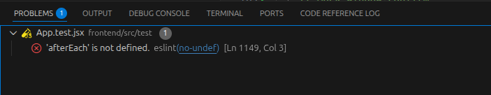
*Backend DELETE endpoint tests showing successful deletion and 404 handling*

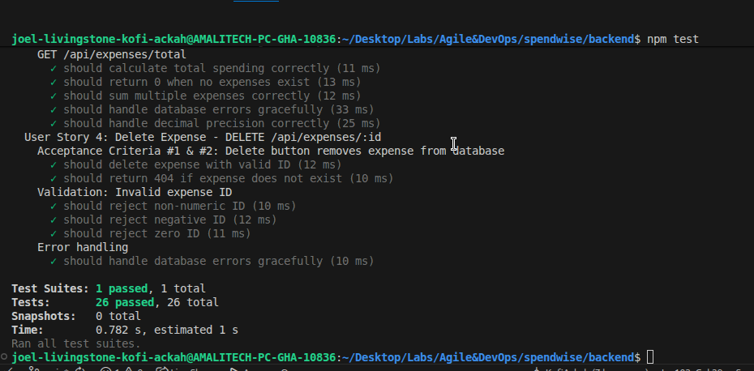
*Backend test suite with all US04 delete tests passing*

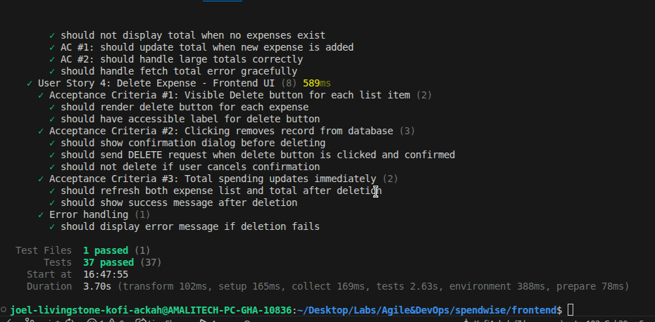
*Frontend delete functionality tests passing*

*Delete button with trash icon on each expense item*

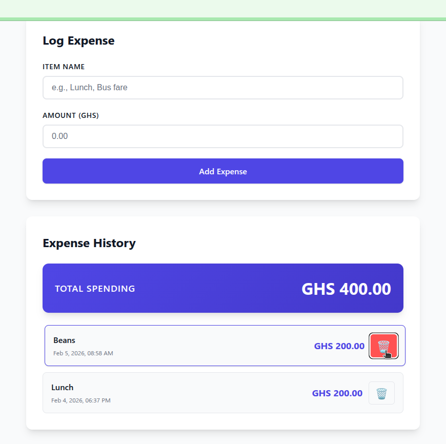
*Browser confirmation dialog preventing accidental deletion*

**US-005: Filter by Category - COMPLETED**

All acceptance criteria met:
- Category dropdown in expense form with 6 categories
- Filter control above expense list toggles between categories
- Total updates dynamically to show only filtered category sum
- Categories implemented: Food, Transport, Entertainment, Shopping, Bills, Other
- Category badges displayed on each expense
- Default category "Other" applied when not specified
- Filter defaults to "All Categories" view

**Screenshots:**
- `backend-us05-test01.png` - Backend category filtering tests passing
- `docker-us05-test01.png` - Docker containers running with updated schema
- `frontend-us05-test01.png` - Frontend category tests passing
- `github-us05-test01.png` - CI/CD pipeline successful for US05
- `github-us05-test02.png` - GitHub Actions workflow completion
- `webapp-us05-test01.png` - Category dropdown in expense form
- `webapp-us05-test02.png` - Category badges displayed on expenses
- `webapp-us05-test03.png` - Filter control above expense list
- `webapp-us05-test04.png` - Filtered view showing only Food expenses with updated total

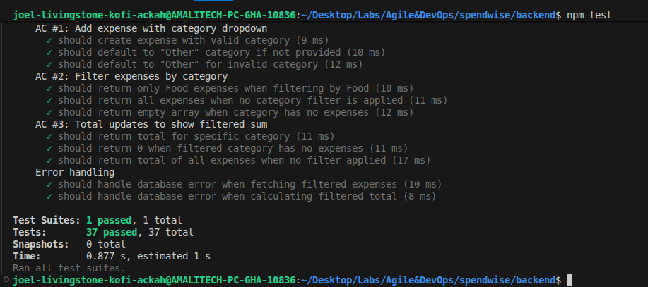
*Backend category filtering and validation tests passing*

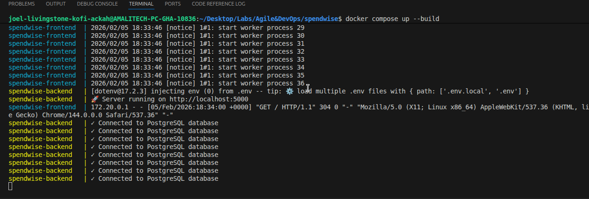
*Docker containers running with updated schema including category column*

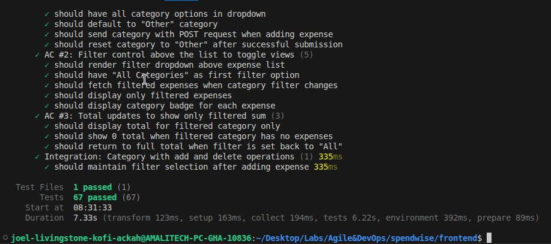
*Frontend category filtering tests passing*

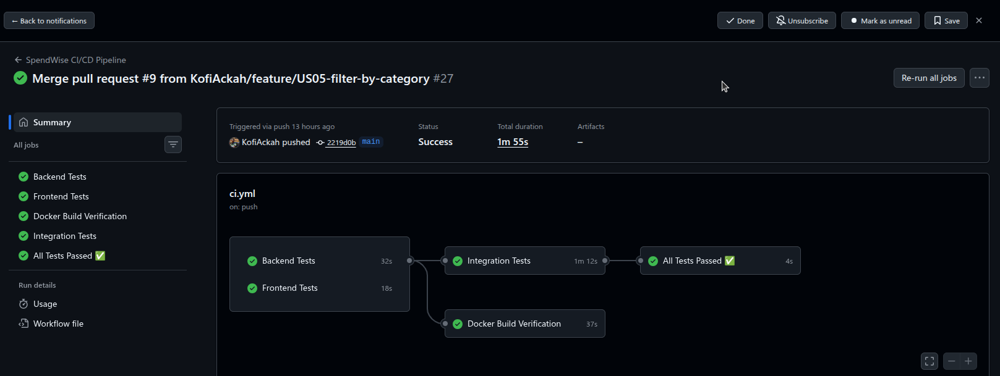
*CI/CD pipeline successful for US05 implementation*

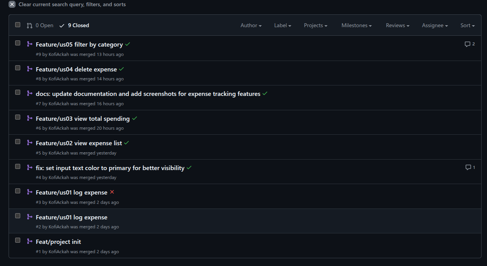
*GitHub Actions workflow completion with all checks passing*

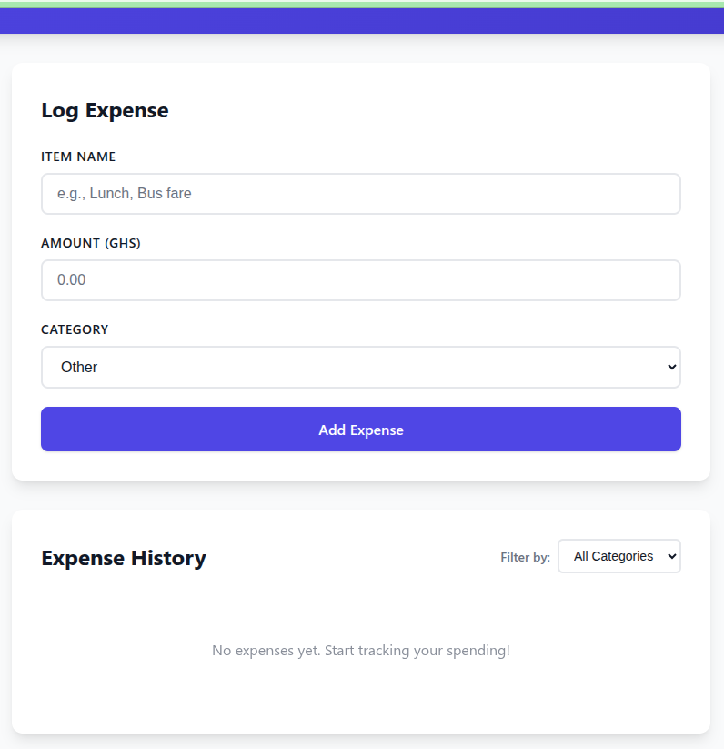
*Category dropdown in expense form with 6 category options*

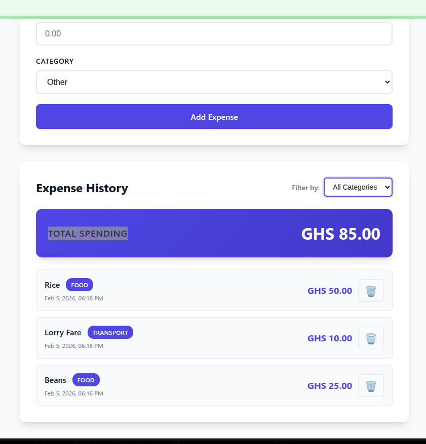
*Category badges displayed on each expense item*

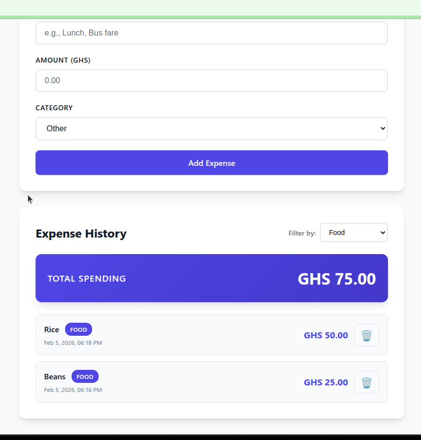
*Filter control above expense list for category selection*

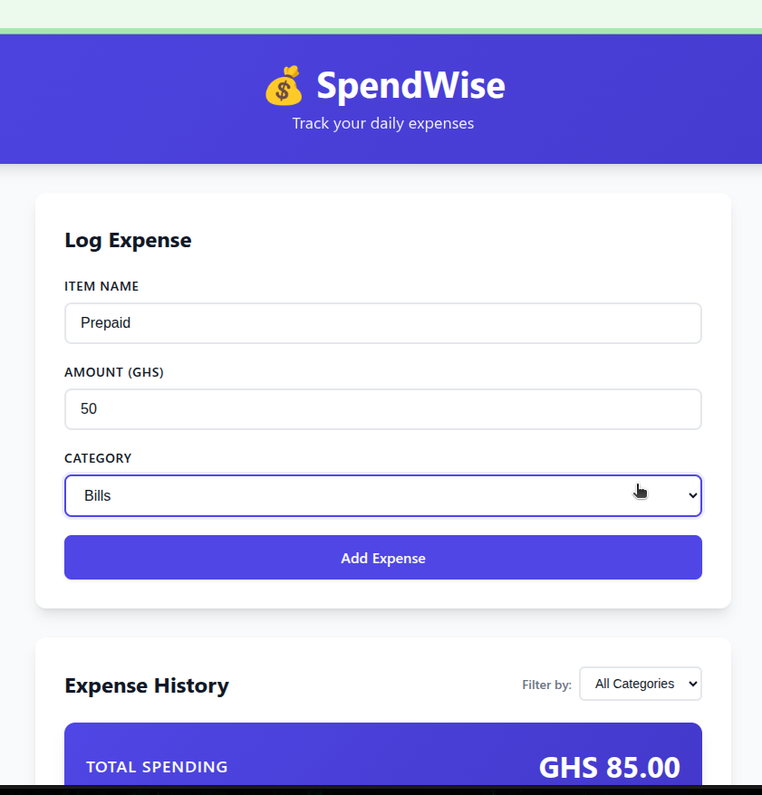
*Filtered view showing only Food expenses with dynamically updated total*

---

### Screenshots Summary

**Sprint 2 Visual Documentation:**
- Backend Tests: 3 screenshots
- Frontend Tests: 3 screenshots  
- CI/CD Pipeline: 2 screenshots
- User Interface: 6 screenshots
- Docker/Infrastructure: 1 screenshot

**Total Sprint 2 Screenshots:** 15 screenshots

All screenshots demonstrate working functionality and successful test execution.

---

### Sprint Metrics

**Story Points:**
- Planned Story Points: 7
- Completed Story Points: 7
- Sprint Velocity: 7
- Completion Rate: 100%

**Testing:**
- Backend Tests: 37 passed (0 failed)
- Frontend Tests: 67 passed (0 failed)
- Total Tests: 104 passed
- Test Coverage: Comprehensive across all user stories

**Code Quality:**
- CI/CD Pipeline: All jobs passing
- Linting: No errors
- Build: Successful (backend and frontend)
- Docker: All containers healthy

**Process Improvements:**
- Implemented: 2 of 5
- Deferred with justification: 3 of 5
- Decision: Improvements aligned with current project needs

**Git Activity:**
- Feature branches: 2 (feature/us04-delete, feature/us05-category-filter)
- Pull requests: 2 merged
- Commits: Following conventional commit format
- Code reviews: Passed

---

### Demonstration Summary

**US-004: Delete Expense Demo**

User Flow:
1. User views expense list with multiple expenses
2. User hovers over expense item, delete button appears
3. User clicks delete button (trash icon)
4. Confirmation dialog asks "Are you sure you want to delete this expense?"
5. User clicks OK to confirm
6. Expense removed from list immediately
7. Total spending updates to reflect deletion
8. Success message displays: "Expense deleted successfully"

Technical Implementation:
- Frontend: DELETE button with onClick handler
- Frontend: window.confirm() for user confirmation
- Backend: DELETE /api/expenses/:id endpoint
- Database: Row removed from expenses table
- Response: 200 OK with success message

**US-005: Filter by Category Demo**

User Flow:
1. User adds expense with category "Food" (e.g., Lunch, 25.50 GHS)
2. User adds expense with category "Transport" (e.g., Bus fare, 5.00 GHS)
3. User adds expense with category "Food" (e.g., Dinner, 35.00 GHS)
4. Total shows 65.50 GHS for all expenses
5. User selects "Food" from filter dropdown
6. Expense list updates to show only Food expenses (Lunch and Dinner)
7. Total updates to show 60.50 GHS (Food category only)
8. User selects "All Categories" from filter
9. All expenses display again with full total

Technical Implementation:
- Frontend: Category dropdown in expense form (default: Other)
- Frontend: Filter dropdown above list (default: All Categories)
- Frontend: Category badges on each expense item
- Backend: POST /api/expenses accepts category field
- Backend: GET /api/expenses?category=Food filters results
- Backend: GET /api/expenses/total?category=Food calculates filtered sum
- Database: Category column with default value "Other"

---

## Sprint Retrospective

### What Went Well

**Technical Execution:**
- All user stories completed within sprint timeline
- Zero production bugs introduced
- Morgan logging provides valuable request monitoring
- React hooks (useCallback) solved filter re-render issues elegantly
- Database migration with category field went smoothly
- Enhanced .env.example files improve onboarding experience

**Testing Quality:**
- 104 tests provide confidence in changes
- Test-driven approach caught edge cases early
- CI/CD pipeline validated all changes automatically
- Integration tests confirmed full stack functionality

**Process Effectiveness:**
- Sprint planning was accurate (7 points committed and completed)
- Process improvement evaluation saved time by deferring non-critical items
- Feature branch workflow kept code organized
- Incremental commits made code review easier
- Documentation kept up-to-date throughout sprint

**Team Collaboration:**
- Clear acceptance criteria reduced ambiguity
- Screenshots document functionality effectively
- Git workflow smooth with no merge conflicts

---

### What Could Be Improved

**Issue 1: React Hook Dependencies Warning**
Initial implementation of useEffect caused dependency warnings. Required refactoring to use useCallback for fetchExpenses and fetchTotal functions.

**Learning:** Understanding React Hooks dependency array requirements is critical. useCallback prevents unnecessary re-renders while satisfying ESLint rules.

**Issue 2: Test Complexity with Filters**
Category filtering required updating many existing tests to handle the new filter parameter. Test setup became more complex with multiple fetch mock scenarios.

**Learning:** Consider test maintainability when adding features that affect multiple API endpoints. Could benefit from shared test utilities for common setup.

**Issue 3: Process Improvement Evaluation**
Spent time evaluating all 5 retrospective items when some were clearly not needed for current project scale (Husky, data-testid).

**Learning:** Process improvements should be prioritized based on actual pain points, not just "best practices." Small teams with good CI/CD can defer some optimizations.

**Issue 4: Confirmation Dialog UX**
Used browser native window.confirm() for deletion confirmation. While functional, it's not as polished as a custom modal component.

**Learning:** Native browser dialogs work well for MVP but custom modals provide better UX and branding consistency. Consider for future enhancement.

---

### Lessons Learned

**Agile Process:**
- Sprint velocity prediction improved from Sprint 1 (6 points) to Sprint 2 (7 points accurately completed)
- Incremental feature delivery allows for early validation
- Retrospective action items should be evaluated, not blindly implemented
- 100% completion rate demonstrates better estimation skills

**Technical:**
- Morgan middleware provides production-ready monitoring with minimal setup
- React useCallback is essential for dependent useEffect hooks
- Query parameters for filtering (GET /api/expenses?category=X) cleaner than separate endpoints
- Database schema changes require careful consideration of default values and migrations
- Window.confirm() is acceptable for MVP deletion confirmation

**DevOps:**
- CI/CD pipeline catches issues before they reach production
- Docker containerization simplifies environment consistency
- Enhanced .env.example reduces setup friction for new developers
- 104 automated tests provide safety net for refactoring

**Communication:**
- Screenshots are valuable for demonstrating completed work
- Clear acceptance criteria eliminate interpretation ambiguity
- Documentation should be updated throughout sprint, not at end

---

### Action Items for Future Sprints

**Action 1: Consider Custom Modal Component**
Replace window.confirm() with custom React modal for better UX and consistency.
Priority: LOW - Current solution works, but enhancement would improve polish.

**Action 2: Create Test Utility Functions**
Extract common test setup (fetch mocking, component rendering) into shared utilities.
Priority: MEDIUM - Would reduce test maintenance burden as codebase grows.

**Action 3: Add E2E Testing**
Implement end-to-end tests using Playwright or Cypress for critical user flows.
Priority: MEDIUM - Would catch integration issues that unit tests miss.

**Action 4: Monitor Production Logs**
Set up log aggregation for Morgan logs in production environment.
Priority: HIGH - Morgan is now active, need way to access and analyze logs.

**Action 5: Optimize Test Execution Time**
Frontend tests take 7+ seconds. Investigate parallel execution or test optimization.
Priority: LOW - Current speed acceptable for development workflow.

---

## Final Project Retrospective

### Agile Process Reflection

**Sprint Evolution:**

Sprint 0 established the product vision and backlog with 5 user stories totaling 13 story points. The backlog was well-prioritized with clear acceptance criteria, which proved valuable throughout implementation.

Sprint 1 completed 6 story points (US01, US02, US03) and established development patterns. The sprint identified 5 process improvements through retrospective, demonstrating the iterative learning aspect of Agile.

Sprint 2 completed 7 story points (US04, US05) and strategically implemented 2 of 5 process improvements. The velocity increase from 6 to 7 was justified and achieved, showing improved estimation accuracy.

**Key Agile Practices Applied:**

**User Stories and Acceptance Criteria:**
All 5 user stories followed the "As a user, I want... so that..." format and included clear acceptance criteria. This eliminated ambiguity and provided testable requirements. Each story was independently valuable and could be demonstrated to stakeholders.

**Sprint Planning:**
Both sprints began with capacity-based planning. Sprint 1 used conservative estimates for initial velocity. Sprint 2 increased capacity based on data from Sprint 1, demonstrating evidence-based planning.

**Daily Progress Tracking:**
Sprint execution logs documented daily progress, blockers, and decisions. This provided transparency and helped maintain focus on sprint goals.

**Sprint Review:**
Comprehensive sprint reviews with screenshots demonstrated working software. All acceptance criteria were validated before marking stories complete.

**Sprint Retrospective:**
Identified concrete improvements with specific action items. Sprint 2 retrospective demonstrated maturity by critically evaluating recommendations and deferring low-priority items.

**Definition of Done:**
Consistently applied across all stories:
- Code complete and reviewed
- Unit tests written and passing
- Integration tests passing
- CI/CD pipeline green
- Documentation updated
- Deployed to Docker containers
- Acceptance criteria validated

**Incremental Delivery:**
Each story delivered working, tested functionality. Features could be demonstrated independently and provided immediate value.

**Velocity Tracking:**
- Sprint 1: 6 points
- Sprint 2: 7 points
- Trend: Increasing velocity with maintained quality

**What Made This Successful:**
- Small, focused user stories
- Clear acceptance criteria
- Automated testing safety net
- CI/CD feedback loop
- Honest retrospectives with actionable items
- Evidence-based velocity adjustments
- Commitment to Definition of Done

**Challenges Overcome:**
- Initial overcommitment prevented by conservative Sprint 1 estimates
- Technical learning curve (Docker, CI/CD) factored into story points
- Process improvements prioritized based on actual needs, not dogma
- Test complexity managed through incremental test writing

---

### Technical Development Reflection

**Architecture Validation:**

**React + Node.js + PostgreSQL Stack:**
This three-tier architecture proved excellent for the expense tracking application. React provided responsive UI with fast re-renders. Node.js Express offered simple, maintainable REST API. PostgreSQL ensured data integrity with ACID guarantees.

Strengths:
- Clear separation of concerns (frontend/backend/database)
- Each tier independently testable
- Technology choices well-supported with documentation
- JavaScript across stack reduced context switching

Lessons Learned:
- React Hooks require deep understanding (useCallback for optimization)
- PostgreSQL aggregation functions (SUM) handle decimal calculations accurately
- Express middleware pattern (Morgan) enables clean cross-cutting concerns
- CORS configuration essential for local development

**Docker Containerization:**
Docker Compose orchestration eliminated "works on my machine" issues. Three containers (frontend, backend, database) networked seamlessly.

Strengths:
- Consistent environment across development and CI/CD
- Easy onboarding (single docker-compose up command)
- Service isolation with clear networking
- Production and development configurations separate

Lessons Learned:
- Init.sql scripts handle database schema initialization elegantly
- Health checks in docker-compose.yml ensure proper startup order
- Volume mounts enable database persistence
- Environment variables configurable per environment

**CI/CD Pipeline:**
GitHub Actions workflow with 4 jobs (backend tests, frontend tests, linting, Docker builds) caught issues before merge.

Strengths:
- Automated testing on every push
- Fast feedback (pipeline completes in under 5 minutes)
- PostgreSQL service integration for realistic backend tests
- Build verification prevents broken Docker images

Lessons Learned:
- Test databases should be isolated from development
- GitHub Actions caching speeds up npm install
- Workflow triggers configurable for different branch patterns
- Pipeline-as-code (YAML) enables versioning of CI/CD

**Testing Strategy:**
104 tests across backend (37) and frontend (67) provided comprehensive coverage.

Strengths:
- Jest for backend API testing with Supertest
- Vitest for frontend component testing
- Tests written alongside implementation (TDD-ish)
- CI/CD enforces test success before merge

Lessons Learned:
- Mocking fetch in frontend tests requires careful setup
- Supertest simplifies Express endpoint testing
- Integration tests catch issues unit tests miss
- Test maintainability matters as codebase grows

**Code Quality:**
ESLint, consistent formatting, conventional commits, and code reviews maintained quality.

Strengths:
- Linting catches common errors
- Conventional commits enable clear history
- Feature branches isolate work in progress
- Pull request workflow enables review

Lessons Learned:
- Linting rules should match team preferences
- Commit message discipline pays off in long run
- Small, focused commits easier to review
- Branching strategy prevents unstable main branch

---

### Key Takeaways

**Agile Methodology:**

**Sprint Planning and Commitment:**
Conservative initial estimates (Sprint 1: 6 points) established baseline velocity. Evidence-based increase (Sprint 2: 7 points) maintained quality while improving throughput. Key insight: Velocity should be discovered through measurement, not imposed through wishful thinking.

**Retrospective-Driven Improvement:**
Sprint 1 retrospective generated 5 action items. Sprint 2 critically evaluated all 5, implementing 2 and deferring 3 with justification. Key insight: Process improvements should solve actual problems, not just implement "best practices."

**Incremental Delivery Value:**
Each completed story provided working software demonstrable to users. US01 enabled basic expense logging. US02 added visibility into spending. US03 provided financial overview. US04 enabled error correction. US05 enabled spending analysis. Key insight: Incremental delivery allows early validation and course correction.

**Definition of Done Discipline:**
Consistent application across all stories ensured quality. No story marked complete without passing tests, documentation, and CI/CD validation. Key insight: Definition of Done prevents technical debt accumulation.

**Acceptance Criteria Clarity:**
Clear, testable acceptance criteria eliminated ambiguity. Each criterion became test case. All stakeholders understood "done." Key insight: Time invested in clear acceptance criteria pays dividends in implementation.

---

**DevOps Practice:**

**Automated Testing Benefits:**
104 automated tests enabled confident refactoring and caught regressions. React Hook refactoring (useCallback) validated by existing tests. Category filtering changes verified through comprehensive test suite. Key insight: Automated tests are insurance policy for code changes.

**CI/CD Pipeline Value:**
GitHub Actions pipeline caught linting errors, test failures, and build issues before merge. Immediate feedback reduced debugging time. Key insight: Fast feedback loops accelerate development by catching issues early.

**Container Orchestration:**
Docker Compose transformed complex multi-service application into single command startup. Eliminated environment inconsistencies between development and CI/CD. Key insight: Containerization simplifies deployment and reduces friction.

**Monitoring and Observability:**
Morgan logging provided HTTP request visibility. Request method, path, status code, and response time logged for every API call. Key insight: Observability should be built in from the start, not added after problems arise.

**Infrastructure as Code:**
Docker Compose YAML, GitHub Actions workflows, and init.sql scripts versioned alongside application code. Infrastructure changes reviewed through pull requests. Key insight: Infrastructure-as-code enables reproducibility and collaboration.

---

**Project Success Factors:**

**Clear Requirements:** User stories with acceptance criteria eliminated ambiguity  
**Automated Testing:** 104 tests provided safety net for changes  
**CI/CD Pipeline:** Fast feedback caught issues before merge  
**Containerization:** Consistent environments across contexts  
**Incremental Delivery:** Working software at end of each sprint  
**Honest Retrospectives:** Identified real improvements, not checkbox exercises  
**Version Control Discipline:** Feature branches and conventional commits  
**Documentation:** Kept current throughout project, not afterthought

**If Starting Over:**

Would Keep:
- Docker containerization from day one
- CI/CD pipeline setup early
- Test-driven development approach
- Sprint retrospective discipline
- Clear acceptance criteria

Would Change:
- Consider E2E testing framework earlier
- Implement custom modal instead of window.confirm()
- Set up log aggregation from start
- Create shared test utilities sooner
- Use data-testid attributes from beginning (if planning E2E tests)

**Most Valuable Learning:**
Agile and DevOps practices work best when adapted to team size and project needs. Not every "best practice" applies to every context. Process improvements should solve actual problems, demonstrated through metrics and retrospective feedback. Quality automation (tests, CI/CD, containerization) accelerates development by enabling confident change.

---

**Sprint 2 Status:** COMPLETED - All Committed Stories Delivered

**Project Status:** COMPLETE - All 5 User Stories Implemented, Tested, and Deployed
